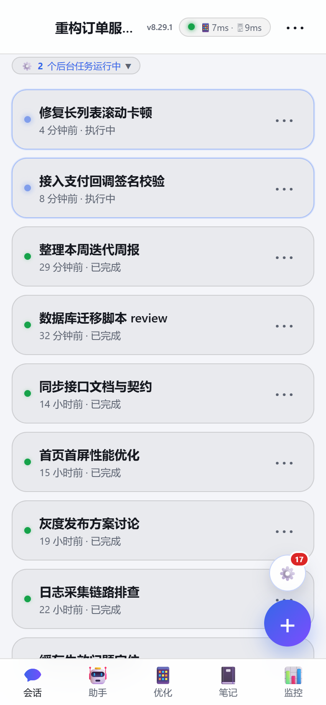
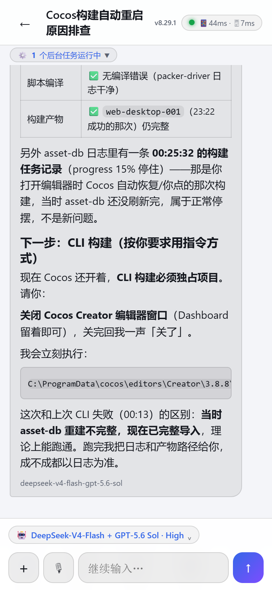
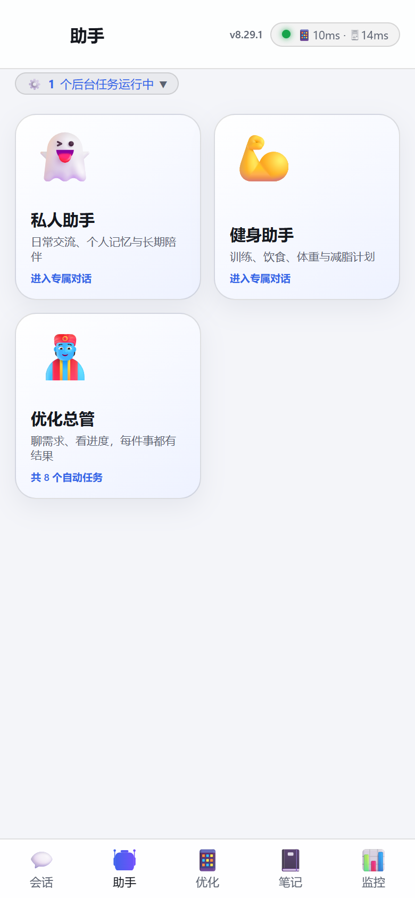
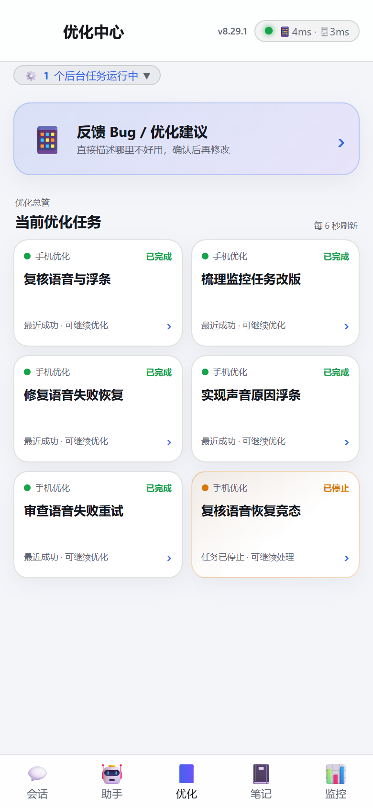
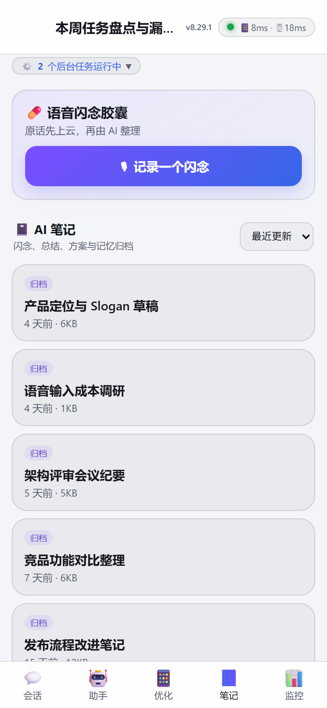
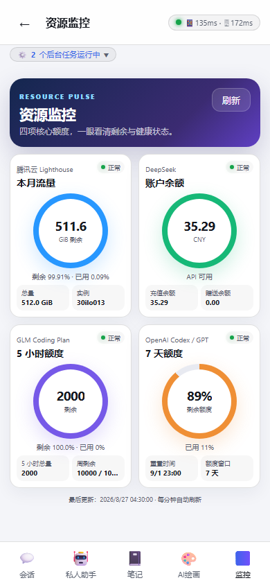
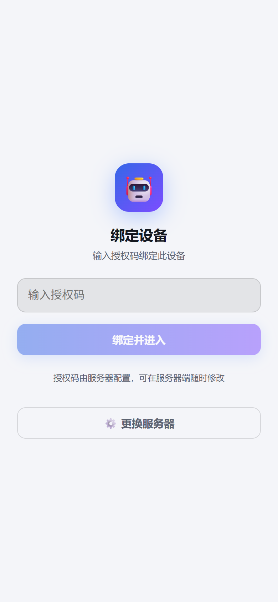
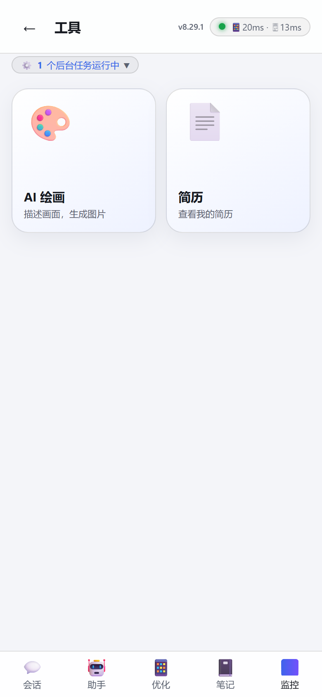
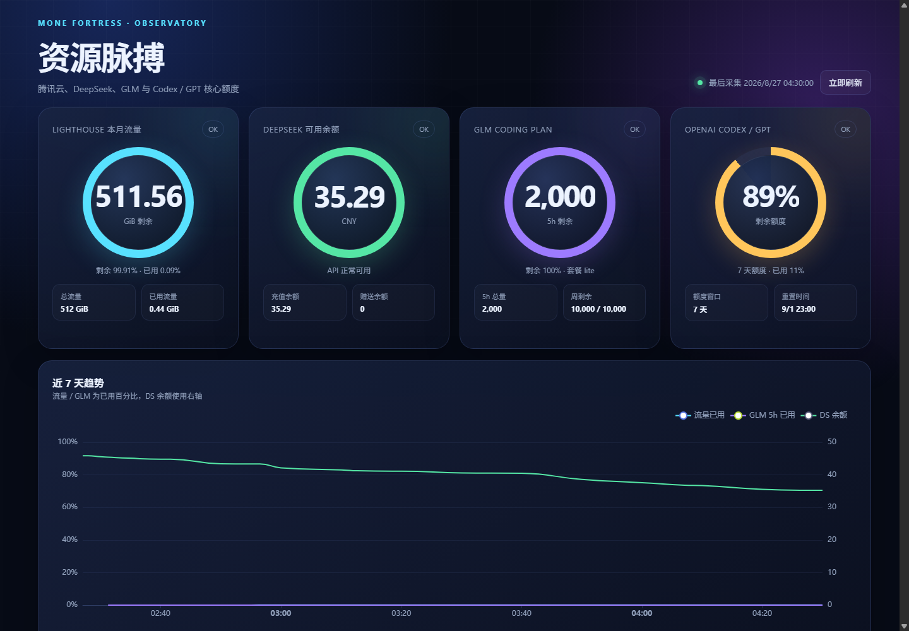

# 巴拉丁（Balading）· 把你主电脑上的 AI Agent 装进手机

> 让手机随时随地访问你主电脑上的 [DeepSeek Harness](https://github.com/deepseek-ai/deepseek-harness)（DSH）。
> 不是把桌面 Web GUI 塞进手机，而是**为手机重新设计的前端 + 独立设备认证层**，业务数据与 AI 执行全部来自你自己的主电脑。

<p>
  
  
  
  
  
  
</p>

**一句话架构**：界面与认证跑在海外 VPS（React 前端 + **零运行时依赖**的 Node 网关），所有会话与 AI 执行源于主电脑 DSH，两者通过 frp 内网穿透隧道连接；手机通过 **PWA 或 Android APK** 接入，首次启动填入你自己的服务器地址即可。

---

## 📱 实机界面

> 以下均为真实运行截图（连接真实 DSH 数据源），非设计稿。

| 会话列表 | 对话页 | 助手宫格 |
| :---: | :---: | :---: |
|  |  |  |
| 运行/完成/异常三态账本、未读角标、后台任务计数 | Markdown 渲染、工具卡折叠、可打断发送 | 多助手独立会话，各自绑定工作目录 |

| 优化中心 | AI 笔记 | 资源监控 |
| :---: | :---: | :---: |
|  |  |  |
| 需求直接派发成后台任务并回写进度 | 主电脑笔记同步 + 语音闪念胶囊 | 云主机流量 / 各家模型额度与余额聚合 |

| 设备绑定 | 工具页 | 桌面版监控仪表盘 |
| :---: | :---: | :---: |
|  |  |  |
| 一次性令牌 / 授权码 → 30 天设备会话 | AI 绘画等扩展入口 | 同一套数据的宽屏视图与 7 日趋势 |

---

## 🎯 这个项目解决了什么

本地跑着一个能改代码、跑命令、调工具的 AI Agent，但它被锁死在那台开着机的 Windows 电脑前。
巴拉丁把这条链路补完：**人在外面 → 手机 → 公网 VPS → 内网穿透 → 家里的主电脑 → Agent 真的干活**，并且这条链路自带认证、离线兜底、后台通知和断线自愈。

## ✨ 功能一览

- **设备绑定认证**：一次性令牌 / 万能授权码 → HMAC-JWT Cookie，30 天会话，可设密码解锁
- **会话与对话**：列表 / 聊天 / 工具卡片 / 图片查看 / 任务 / 工作区 / 资源监控
- **Markdown 渲染**：粗体、列表、表格、代码块、引用、图片
- **交互细节**：思考过程默认隐藏；运行中底部跟随 +「回到底部」；发送可打断（steer）；图片草稿（先选图后打字一起发）
- **图片链路**：自动压缩（≤100KB 缩略图）+ 点击看原图 + 附件永久缓存
- **离线能力**：Service Worker 静态资源永久缓存 + API SWR + 离线兜底
- **连接可观测**：顶部双段状态指示（手机→服务器、服务器→主电脑）
- **状态账本**：蓝点运行、绿点完成、红点异常；未读数同步到 App 角标
- **原生后台通知**：Android 前台服务，WebView 休眠 / 切后台 / 锁屏后仍能收到任务终态
- **语音输入**：流式 ASR 接入，含用量与费用台账
- **Android 壳**：Capacitor 打包，APK 可侧载；**首次启动输入你自己的服务器地址**，不绑定任何特定服务器

## 🏗️ 技术要点

| 维度 | 做法 |
| --- | --- |
| 网关 | `server/index.mjs`，仅依赖 `ws` + `qrcode`，其余全部 `node:http` 手写：设备绑定、JWT 签发校验、反向代理、WebSocket 升级代理、静态托管、CORS |
| 认证 | 一次性令牌用后即焚并持久化移除；万能码走环境变量；签名密钥支持 systemd 环境变量或本地 `.secret` 自动生成 |
| 穿透 | 主电脑 frpc（443 TLS）→ VPS nginx stream SNI 分流 → frps → 网关 `DSH_TARGET` |
| 前端 | React 18 + Vite 5，hash 路由，无状态管理库；列表虚拟窗口化（见 `web/tests/list-performance.test.mjs`） |
| 缓存 | SW 版本绑定发布号，静态资源 immutable、入口 no-cache，升级路径见 `docs/TROUBLESHOOTING.md` |
| 遥测 | 前端错误上报前本地脱敏 URL / Windows 路径 / 凭据（`web/src/telemetry.js`） |
| 测试 | Node 原生 test runner，`server` 24 项 + `web` 73 项，全部可离线运行 |
| 工程治理 | 多 Agent 并行开发的分支 / worktree / 写入锁规范，见 [docs/AI-MULTI-AGENT-DEVELOPMENT.md](docs/AI-MULTI-AGENT-DEVELOPMENT.md) |

## ⚠️ 前提条件（没有这些无法使用）

巴拉丁是**手机 → 你的云服务器 → 你的主电脑**的链路，不是独立可用的 App。使用前必须具备：

1. **一台海外云服务器（VPS）**：公网 IP，已部署本项目的网关（`server/`）+ nginx + frps。
2. **一个域名（强烈推荐）**：解析到 VPS，配好 HTTPS；没有域名只能用 `http://VPS_IP:8788` 且仅限 PWA 同源场景。
3. **主电脑 DSH 在线**：主电脑跑 `dsh web`，并通过 frpc 隧道连到 VPS。
4. **手机能访问 VPS**（443 端口）。

## 🚀 快速开始

### 使用者：PWA（最简单）

手机浏览器直接打开你服务器上的地址（如 `https://m.yourdomain.com`），同源自动跳过服务器绑定页，输入授权码即可绑定设备。

### 使用者：Android APK

1. 从 Releases 下载 `app-release.apk` 并安装（需允许「安装未知来源应用」）。
2. 首次打开，输入你自己的网关地址：域名（推荐，HTTPS）或 `VPS_IP:8788`，点「连接并进入」。
3. 输入授权码（万能码或一次性令牌）完成设备绑定。

### 部署者：海外 VPS（免备案）

> 服务器在境外 + 域名解析境外 = **无需 ICP 备案**。
> **完整分步手册：[docs/AGENT-INSTALL.md](docs/AGENT-INSTALL.md)**（从空白 VPS 到手机可用，逐条命令）。

1. **VPS**：Vultr / DigitalOcean / Hetzner 任选，1C1G 即可；推荐新加坡 / 东京 / 香港节点。
2. **域名**：任意注册商购买，A 记录指向 VPS IP；推荐 Cloudflare 托管 DNS。
3. **部署**：上传仓库 → 复制 `deploy/balading-gateway.service.example` 到 systemd → 生成强随机签名密钥（`openssl rand -base64 32`）→ nginx + certbot 签 HTTPS 证书 → 启动网关与 frps。
4. **主电脑**：跑 DSH（`dsh web --trusted-host m.yourdomain.com`）+ frpc 隧道（`serverAddr=YOUR_VPS_IP`）。
5. **手机**：PWA 打开 `https://m.yourdomain.com`，或用 APK 首启输入该地址。

`deploy/` 下四份模板均以 `.example` 结尾，域名、密钥、IP 全部是占位符，按注释替换成你自己的值即可。

## 🔧 本地开发

```powershell
# 0) 前端构建期配置（各人主电脑目录不同，不入库）
cd web; Copy-Item .env.example .env.local   # 按注释填写 VITE_DSH_WORKSPACE

# 1) 启动认证网关（默认反代本机 DSH 3080；没有 DSH 也能测绑定与静态托管）
cd server; node index.mjs
#    启动日志会打印万能授权码（未配置 MOBILE_BIND_CODE 时随机生成）

# 2) 前端热更新 → http://127.0.0.1:5173（/api 代理到 8788）
cd web; npm run dev

# 3) 或构建后由网关托管 → http://127.0.0.1:8788
cd web; npm run build

# 4) 测试
cd server; npm test
cd web; npm test
```

常用环境变量：

| 变量 | 默认 | 说明 |
| --- | --- | --- |
| `MOBILE_PORT` | `8788` | 网关监听端口 |
| `MOBILE_HOST` | `127.0.0.1` | 只监听本机，由 nginx 反代 |
| `DSH_TARGET` | `http://127.0.0.1:3080` | 主电脑 DSH 入口（VPS 上填 frp 隧道口） |
| `MOBILE_SIGNING_SECRET` | 自动生成 | 会话签名密钥，生产必须设强随机值 |
| `MOBILE_BIND_CODE` | 随机 | 万能授权码，不设则每次启动随机生成并打印 |
| `MOBILE_SESSION_TTL` | `2592000` | 设备会话秒数，默认 30 天 |
| `MOBILE_NOTES_DIR` | `../../ai-notes` | AI 笔记目录 |
| `MOBILE_CAPSULE_CWD` | `process.cwd()` | 闪念整理会话的工作目录 |

构建 APK：见 [P2-BUILD.md](P2-BUILD.md)（`npm run build && npx cap sync android && cd android && ./gradlew assembleRelease`）。

## 📁 目录结构

```
balading/
├─ web/                  React + Vite 前端（手机 UI）
│  ├─ src/               页面 / 组件 / Markdown 渲染 / 遥测 / 动态服务器绑定
│  ├─ public/sw.js       Service Worker
│  ├─ tests/             73 项前端测试
│  └─ .env.example       前端构建期配置模板
├─ server/               认证网关（node:http 手写）
│  ├─ index.mjs          绑定 / 校验 / 反代 / 静态托管 / WS 代理 / CORS
│  ├─ speech-stream.mjs  流式语音识别代理
│  └─ *.test.mjs         24 项网关测试
├─ deploy/               VPS 部署模板（nginx / frp / systemd，全部 .example）
├─ android/              Capacitor 安卓壳（需 Android SDK 编译）
├─ docs/                 架构 / 契约 / 部署 / 排障 / 路线图 / 开发历程
│  └─ screenshots/       README 实机截图
├─ scripts/              发布前敏感信息扫描、可视化验收脚本
├─ CHANGELOG.md          版本变更记录
└─ AGENTS.md             多 Agent 协作硬规则
```

## 🔐 安全说明

- DSH 自身无认证；认证完全由本项目网关承担（一次性令牌 + HMAC-JWT Cookie）。
- 签名密钥：`MOBILE_SIGNING_SECRET`（systemd 环境变量）或 `server/.secret`（**不入库**）。
- 万能授权码：`MOBILE_BIND_CODE` 环境变量；未配置时启动随机生成（见网关日志）。
- 一次性令牌用后即焚，并从 `tokens.json` 持久移除，重启不可复用。
- 设备会话默认 30 天；建议开启密码解锁。
- CORS 反射请求 Origin 并允许携带凭据（APK WebView 需要）；**请务必使用 HTTPS 部署**。
- 仓库内 `.gitignore` 已排除 `server/.secret`、`tokens.json`、运行时数据、`evidence/`、签名文件与 `.env.local`。
- 发布前可运行 `scripts/publish-public.ps1 -DryRun` 做敏感信息扫描。

## 📚 文档

| 文档 | 内容 |
| --- | --- |
| [docs/AGENT-INSTALL.md](docs/AGENT-INSTALL.md) | **完整安装手册**：从空白 VPS 到手机可用，逐条命令 |
| [docs/DEPLOYMENT.md](docs/DEPLOYMENT.md) | 简化版部署与热更新流程 |
| [docs/ARCHITECTURE.md](docs/ARCHITECTURE.md) | 整体架构与数据流 |
| [docs/API-CONTRACT.md](docs/API-CONTRACT.md) | 网关与 DSH 的接口契约 |
| [docs/TROUBLESHOOTING.md](docs/TROUBLESHOOTING.md) | 常见故障与排障路径 |
| [docs/ANDROID-VOICE-INPUT.md](docs/ANDROID-VOICE-INPUT.md) | Android 语音输入权限与长按排障 |
| [docs/AI-MULTI-AGENT-DEVELOPMENT.md](docs/AI-MULTI-AGENT-DEVELOPMENT.md) | 多 Agent 并行开发的防覆盖治理方案 |
| [docs/MOBILE-OPTIMIZATION-2026-08-26.md](docs/MOBILE-OPTIMIZATION-2026-08-26.md) | 一次完整的移动端体验优化复盘 |
| [docs/DEVELOPMENT-HISTORY.md](docs/DEVELOPMENT-HISTORY.md) | 从想法到上线的完整迭代记录 |
| [docs/ROADMAP.md](docs/ROADMAP.md) | 路线图 |

## License

[MIT](LICENSE)
